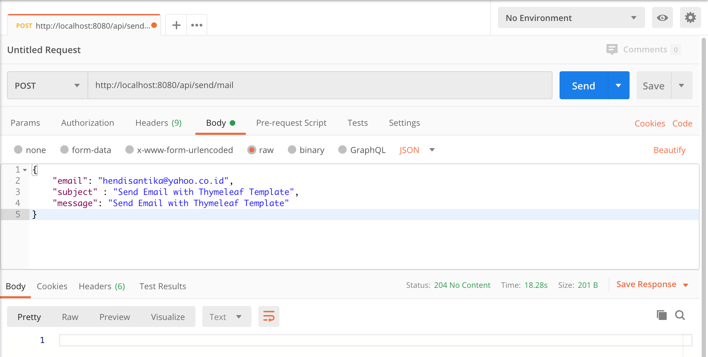

# thymeleaf-template

Send Email with Thymeleaf Template using Spring Boot Application.

## Things to do list:
1. Clone this repository: `git clone https://github.com/hendisantika/thymeleaf-template.git`.
2. Go to your folder: `cd thymeleaf-template`.
3. Run the application: `mvn clean spring-boot:run`.
4. Open POSTMAN App: 

`POST | http://localhost:8080/api/send/mail`

## Screen shot

Send Email

